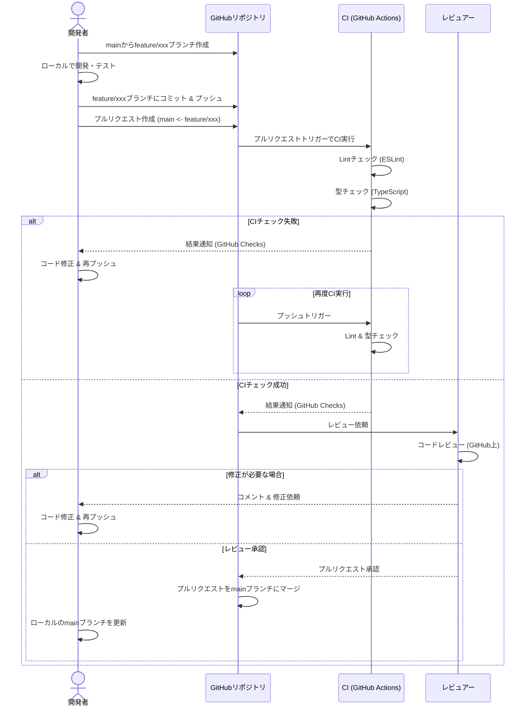

# Blueprint AI 開発ドキュメント

このドキュメントは、Blueprint AIプロジェクトの開発者向けガイドです。プロジェクトのセットアップ、構造、開発プロセス、規約、およびその他の関連情報を提供します。

## 1. 開発環境のセットアップ方法

### 1.1 必要なツールとバージョン

*   **Node.js:** `v20` 以上 (`package.json` および `.github/workflows` で指定)
*   **npm:** Node.jsに同梱されているバージョン (プロジェクトの依存関係管理とスクリプト実行に使用)
*   **Git:** バージョン管理システム
*   **Google GenAI APIキー:** Gemini 2.5 Proモデルへのアクセス権限が必要です。

### 1.2 環境構築手順

1.  **リポジトリのクローン:**
    ```bash
    git clone https://github.com/your-username/blueprint-ai.git
    cd blueprint-ai
    ```
2.  **依存関係のインストール:**
    ```bash
    npm install
    ```
    これにより、`package.json` に定義された依存関係が `node_modules` ディレクトリにインストールされます。
3.  **APIキーの設定:**
    アプリケーションの実行にはGoogle GenAI APIキーが必要です。実行時に引数として渡します。
    ```bash
    npm run dev --apikey YOUR-API-KEY
    ```

### 1.3 推奨する開発ツール

*   **コードエディタ:** Visual Studio Code (VSCode) を推奨します。TypeScriptのサポートが充実しており、以下の拡張機能と連携すると開発効率が向上します。
    *   ESLint 拡張機能
    *   Prettier - Code formatter 拡張機能
*   **ターミナル:** 任意のターミナル (bash, zsh, PowerShell など)

## 2. プロジェクトの構造と主要なファイル

### 2.1 ディレクトリ構成

```plaintext
blueprint-ai/
├── .github/                # GitHub Actions ワークフロー
│   └── workflows/
│       ├── pr-lint.yml     # プルリクエスト時のLintチェック用ワークフロー
│       └── pr-typecheck.yml # プルリクエスト時の型チェック用ワークフロー
├── docs/                   # プロジェクトドキュメント (TODOリストなど)
│   └── TODO.md
├── src/                    # メインのソースコード
│   ├── config.ts           # アプリケーション設定の読み込みとデフォルト値
│   ├── documentation.ts    # ドキュメント生成ロジック、プロンプト定義
│   ├── file.ts             # ファイルシステムの操作 (検索、読み込み、保存)
│   ├── index.ts            # アプリケーションのエントリーポイント、CLIコマンド定義
│   └── model.ts            # Google GenAI APIとの連携
├── .gitignore              # Gitで無視するファイル/ディレクトリの指定
├── .prettierrc             # Prettier (コードフォーマッタ) の設定
├── CHANGELOG.md            # プロジェクトの変更履歴
├── CONTRIBUTING.md         # 貢献ガイドライン
├── eslint.config.js        # ESLint (リンター) の設定
├── package.json            # プロジェクトのメタデータ、依存関係、npmスクリプト
├── README.md               # プロジェクトの概要と基本的な使用方法
└── tsconfig.json           # TypeScriptコンパイラの設定
```

### 2.2 主要なファイルの役割

*   **`package.json`**: プロジェクト名、バージョン、依存ライブラリ、開発用スクリプト (`dev`, `lint`, `format`, `typecheck`) などを定義します。
*   **`tsconfig.json`**: TypeScriptコンパイラのオプションを指定します。`target: "es2022"`, `module: "ESNext"`, `strict: true`などが設定されています。
*   **`eslint.config.js`**: ESLintの設定ファイルです。TypeScript用のルール、Prettier連携、import順のルールなどが定義されています。
*   **`.prettierrc`**: Prettierの設定ファイルです。コードの自動整形ルール (インデント、セミコロン、引用符など) を定義します。
*   **`src/index.ts`**: `citty` を使用してCLIインターフェースを定義し、アプリケーションのメインロジックを呼び出すエントリーポイントです。APIキーや出力ディレクトリなどの引数を処理します。
*   **`src/config.ts`**: アプリケーションの設定 (`fileExtensions`, `excludePatterns`, `maxFiles` など) を管理し、コマンドライン引数やデフォルト値から設定オブジェクトを生成します。
*   **`src/model.ts`**: `@google/genai` ライブラリを使用してGoogle GenAI API (Gemini 2.5 Pro) と通信し、プロンプトに基づいてテキスト生成を行う関数を提供します。
*   **`src/file.ts`**: `glob` を使用して指定されたパターンに一致するファイルを検索し、内容を読み込みます。また、生成されたドキュメントを指定されたパスに保存する機能も提供します。
*   **`src/documentation.ts`**: 分析対象のファイル情報を受け取り、Google GenAIモデルに送信するプロンプトを生成します。モデルからの応答を整形し、ドキュメントコンテンツを返す役割を担います。
*   **`.github/workflows/`**: GitHub Actionsの設定ファイルです。プルリクエスト時に自動でLintチェック (`pr-lint.yml`) とTypeScriptの型チェック (`pr-typecheck.yml`) を実行します。

### 2.3 設定ファイルの解説

*   **`tsconfig.json`**:
    *   `target: "es2022"`: 最新のECMAScript機能を利用可能なJavaScriptバージョンに出力します。
    *   `module: "ESNext"`: 最新のECMAScriptモジュールシステムを使用します。
    *   `moduleResolution: "bundler"`: Node.jsの最新のモジュール解決戦略に合わせた設定です。
    *   `strict: true`: TypeScriptの厳格な型チェックオプションをすべて有効にします。
    *   `esModuleInterop: true`: CommonJSモジュールとESモジュールの相互運用性を向上させます。
    *   `skipLibCheck: true`: 依存関係の型定義ファイル (.d.ts) のチェックをスキップし、コンパイル時間を短縮します。
*   **`eslint.config.js`**:
    *   ESLintの推奨ルール (`eslint.configs.recommended`) をベースにしています。
    *   TypeScript用のルール (`@typescript-eslint/eslint-plugin`) とパーサー (`@typescript-eslint/parser`) を使用します。
    *   Prettierとの連携 (`eslint-plugin-prettier`, `eslint-config-prettier`) を設定し、フォーマットに関するルールはPrettierに委譲します。
    *   `import/order` ルールにより、import文の順序を自動で整理します。
    *   未使用変数 (`no-unused-vars`) や `any` 型の使用 (`no-explicit-any`) に関するルールが設定されています。
*   **`.prettierrc`**:
    *   `semi: true`: 文末にセミコロンを付けます。
    *   `singleQuote: true`: 文字列リテラルにシングルクォートを使用します。
    *   `printWidth: 100`: 1行の最大文字数を100文字に設定します。
    *   `trailingComma: "es5"`: 配列やオブジェクトの末尾要素の後ろにカンマを付けます (ES5互換)。
*   **`src/config.ts`**:
    *   `fileExtensions`: 分析対象とするファイルの拡張子リストです。
    *   `excludePatterns`: 分析から除外するファイルやディレクトリのパターンリストです (`node_modules`, `dist`, `.git` など)。
    *   `maxFiles`: 一度に分析する最大ファイル数です。
    *   `apiKey`: Google GenAI APIキー (コマンドライン引数から設定)。
    *   `output`: 生成されたドキュメントの出力先ディレクトリ (コマンドライン引数から設定)。

## 3. 開発ワークフローとプロセス

### 3.1 ブランチ戦略

基本的なGitHub Flowに基づいたブランチ戦略を採用しています。

*   **`main`**: 安定版のコードが格納されるブランチ。直接コミットは行わず、プルリクエスト経由でのみマージされます。
*   **`feature/*`** (例: `feature/add-new-parser`): 新機能の開発を行うためのブランチ。`main`ブランチから作成します。
*   **`bugfix/*`** (例: `bugfix/fix-api-error`): バグ修正を行うためのブランチ。`main`ブランチから作成します。

### 3.2 コミット規約

コミットメッセージは [Conventional Commits](https://www.conventionalcommits.org/) 仕様に従うことを推奨します。これにより、変更履歴の自動生成やバージョニングが容易になります。

例:

*   `feat: add support for yaml configuration files`
*   `fix: correct handling of empty files during analysis`
*   `docs: update README with setup instructions`
*   `style: format code using prettier`
*   `refactor: improve prompt generation logic`
*   `test: add unit tests for file module`
*   `chore: update dependencies`

### 3.3 レビュープロセス

コードの品質を維持するため、以下のレビュープロセスを実施します。



**プロセス概要:**

1.  **ブランチ作成:** `main` ブランチから作業ブランチを作成します。
2.  **開発:** ローカルでコードの変更と基本的なテストを行います。
3.  **コミット & プッシュ:** 変更をコミットし、リモートリポジトリにプッシュします。
4.  **プルリクエスト作成:** `main` ブランチへのプルリクエストを作成します。
5.  **CI実行:** プルリクエストが作成/更新されると、GitHub Actionsが自動的にLintチェックと型チェックを実行します。
6.  **コードレビュー:** CIが成功したら、他の開発者にコードレビューを依頼します。
7.  **修正:** レビューで指摘があれば修正し、再度プッシュします (CIが再実行されます)。
8.  **マージ:** レビューで承認され、CIが成功したら、プルリクエストを `main` ブランチにマージします。

## 4. コーディング規約とベストプラクティス

### 4.1 命名規則

*   **変数・関数:** キャメルケース (`camelCase`)
*   **クラス・インターフェース・型エイリアス:** パスカルケース (`PascalCase`)
*   **定数:** アッパースネークケース (`UPPER_SNAKE_CASE`)
*   **ファイル名:** ケバブケース (`kebab-case.ts`) または パスカルケース (`PascalCase.ts`) (コンポーネントなど)
    基本的にTypeScript/JavaScriptコミュニティの一般的な慣習に従います。ESLintが一部の命名規則をチェックします。

### 4.2 コードフォーマット

コードフォーマットは [Prettier](https://prettier.io/) によって自動的に管理されます。`.prettierrc` ファイルに定義されたルールに基づき、一貫したコードスタイルを維持します。

*   **自動整形:** コミット前にフォーマットを適用することを推奨します。
    ```bash
    npm run format
    ```
    このコマンドは、PrettierによるフォーマットとESLintによる修正可能な問題の自動修正を同時に行います。
*   **エディタ連携:** VSCodeなどのエディタにPrettier拡張機能を導入し、ファイル保存時に自動フォーマットする設定を推奨します。

### 4.3 ドキュメント規約

*   **コードコメント:** 複雑なロジックや、意図が自明でないコードには説明的なコメントを追加します。JSDoc形式でのコメントを推奨します（特に公開APIや複雑な関数）。
*   **README.md:** プロジェクトの概要、インストール方法、基本的な使い方などを記載します。常に最新の状態に保ちます。
*   **CONTRIBUTING.md:** 開発プロセスや規約など、貢献者向けの情報を記載します。
*   **CHANGELOG.md:** プロジェクトのバージョンごとの変更点を記録します。Semantic Versioningに従います。

## 5. デバッグとトラブルシューティング

### 5.1 ログの確認方法

*   **コンソールログ:** アプリケーションは `consola` ライブラリを使用してログを出力します (`src/index.ts`)。実行時の進捗状況やエラー情報は標準出力/標準エラー出力に表示されます。
    ```bash
    npm run dev --apikey YOUR-API-KEY
    ```
    実行時のコンソール出力を確認してください。

### 5.2 デバッグツールの使用方法

*   **Node.js デバッガ:** Node.jsには組み込みのデバッガがあります。`tsx` と組み合わせて使用できます。
    ```bash
    node --inspect-brk node_modules/.bin/tsx ./src/index.ts --apikey YOUR-API-KEY
    ```
    その後、Chrome DevTools (`chrome://inspect`) やVSCodeのデバッガをアタッチしてデバッグします。
*   **VSCode デバッガ:** VSCodeを使用している場合、`launch.json` ファイルを設定してデバッグセッションを構成すると便利です。`tsx` を実行する設定を追加します。

### 5.3 一般的な問題の解決方法

*   **APIキーエラー:**
    *   `apiKey` 引数が正しく渡されているか確認してください (`npm run dev --apikey YOUR-API-KEY`)。
    *   APIキーが有効であり、Gemini 2.5 Proモデルへのアクセス権限があるか確認してください。
*   **依存関係の問題:**
    *   `node_modules` ディレクトリを削除し、再度 `npm install` を実行してみてください。
    *   npmのキャッシュをクリア (`npm cache clean --force`) してから再試行してください。
*   **ファイルが見つからない/除外される:**
    *   `src/config.ts` の `fileExtensions` や `excludePatterns` の設定を確認してください。
    *   分析対象のディレクトリでコマンドを実行しているか確認してください。
*   **型エラー:**
    *   `npm run typecheck` を実行して詳細なエラーメッセージを確認してください。
    *   依存関係の型定義ファイルに問題がある場合は、`@types/` パッケージのバージョンを確認・更新してください。
*   **Lint/フォーマットエラー:**
    *   `npm run lint` でエラー箇所を確認してください。
    *   `npm run format` を実行して自動修正を試みてください。

## 6. テスト方法と戦略

### 6.1 テストの種類と目的

*   **静的解析:**
    *   **Linting (ESLint):** コードスタイルの一貫性を保ち、潜在的なバグを検出します (`npm run lint`)。
    *   **Type Checking (TypeScript):** コンパイル前に型エラーを検出し、コードの堅牢性を高めます (`npm run typecheck`)。
*   **実行時テスト (現状未実装):**
    *   **ユニットテスト:** 個々の関数やモジュールが期待通りに動作するかを検証します。
    *   **統合テスト:** 複数のモジュールを組み合わせた際の動作を検証します。
    *   **E2Eテスト (CLIツールの場合):** 実際のコマンド実行シナリオをシミュレートし、全体の動作を確認します。

`CONTRIBUTING.md` には `npm test` の記載がありますが、`package.json` に対応するスクリプトは定義されていません。実行時テストは今後の課題です。

### 6.2 テストの実行方法

*   **Lintチェック:**
    ```bash
    npm run lint
    ```
*   **型チェック:**
    ```bash
    npm run typecheck
    ```
*   **Lintとフォーマットの自動修正:**
    ```bash
    npm run format
    ```

### 6.3 テストカバレッジの要件

現状、実行時テストが実装されていないため、テストカバレッジの要件は定義されていません。テスト実装時に導入を検討します。

## 7. ビルドとデプロイメント

### 7.1 ビルドプロセス

このプロジェクトは `tsx` を使用してTypeScriptファイルを直接実行するため、明示的なJavaScriptへの**ビルドステップは現在ありません**。開発時には `npm run dev` コマンドで直接 `src/index.ts` を実行します。

将来的に配布可能な形式 (例: 単一実行ファイル) が必要になった場合は、`esbuild`, `pkg`, `nexe` などのツールを使用したビルドプロセスを導入する可能性があります。

### 7.2 デプロイメントフロー

CLIツールとしての**デプロイメントフローは現在定義されていません**。

考えられるデプロイメント戦略:

*   **npm パッケージとして公開:** `npm publish` コマンドを使用してnpmレジストリに公開し、ユーザーが `npm install -g blueprint-ai` でインストールできるようにする。
*   **GitHub Releases:** ビルド成果物 (実行可能ファイルなど) をGitHub Releasesページで配布する。

### 7.3 環境ごとの設定

*   **APIキー:** 現在、Google GenAI APIキーは実行時の `--apikey` 引数で渡す必要があります。`.env` ファイルなどの利用は現状実装されていません。
*   **その他の設定:** `src/config.ts` で定義されている設定 (ファイル拡張子、除外パターンなど) は、現状コード内で管理されています。将来的には設定ファイル (`blueprint.config.js` など) から読み込む機能を追加する可能性がありますが、環境ごとの設定切り替えメカニズムは未定義です。