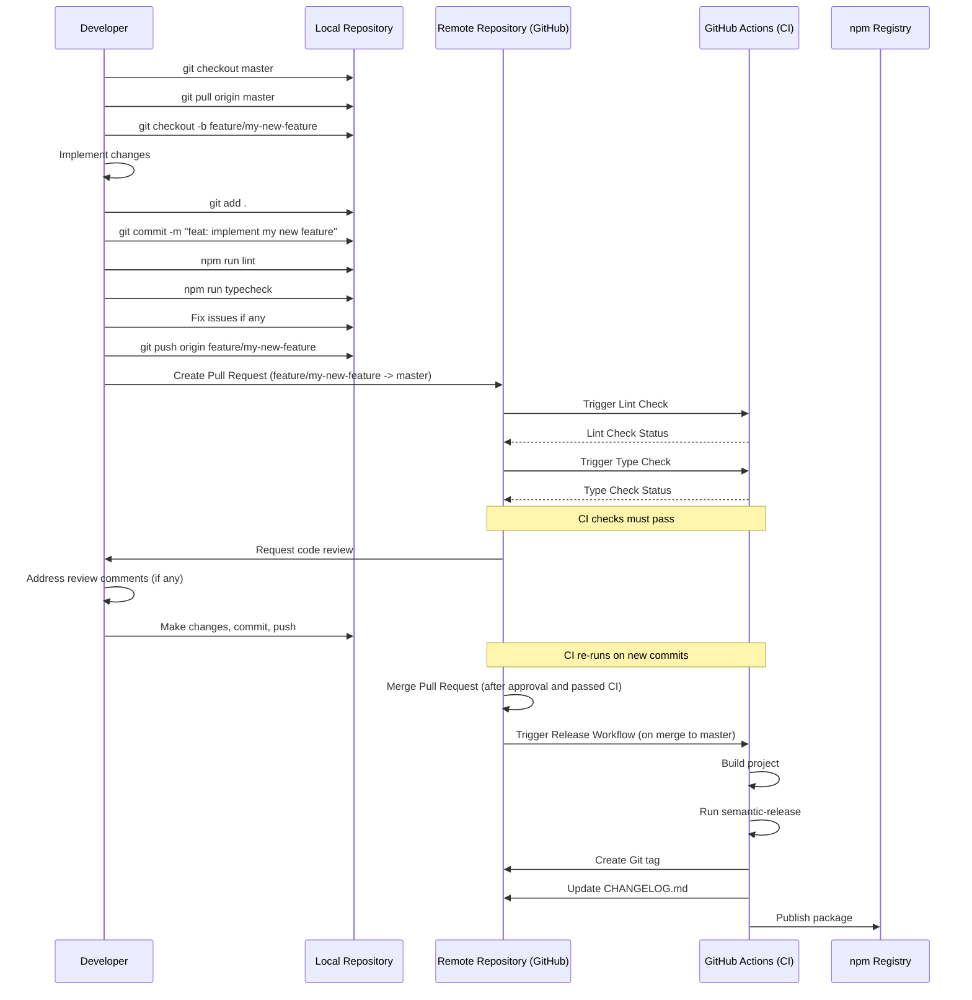

# DocGenius 開発者向けドキュメント

このドキュメントは、DocGenius プロジェクトの開発に関する情報を提供します。

## 1. 開発環境のセットアップ

### 1.1 必要なツールとバージョン

- **Node.js:** v20.x 以降 (プロジェクトの CI 環境や README で指定)
- **npm:** Node.js に同梱されているバージョン
- **Git:** バージョン管理システム

### 1.2 環境構築手順

1.  **リポジトリのクローン:**

    ```bash
    git clone https://github.com/tkhs0813/docgenius.git
    cd docgenius
    ```

2.  **依存関係のインストール:**
    ```bash
    npm install
    ```

### 1.3 推奨する開発ツール

- **コードエディタ:** Visual Studio Code (VS Code)
  - 推奨拡張機能: ESLint, Prettier - Code formatter
- **ターミナル:** OS 標準のターミナルまたは任意のターミナルエミュレータ

## 2. プロジェクトの構造と主要なファイル

### 2.1 ディレクトリ構成

```
docgenius/
├── .github/
│   └── workflows/
│       ├── pr-lint.yml       # PR時のLintチェック用GitHub Actionsワークフロー
│       ├── pr-typecheck.yml  # PR時の型チェック用GitHub Actionsワークフロー
│       └── release.yml       # リリース自動化用GitHub Actionsワークフロー
├── dist/                     # ビルド成果物ディレクトリ (Git管理外)
├── docs/
│   └── TODO.md               # プロジェクトのTODOリスト
├── node_modules/             # 依存パッケージ (Git管理外)
├── src/                      # ソースコードディレクトリ
│   ├── config.ts             # 設定読み込み・デフォルト設定
│   ├── developmentGuide.ts   # ドキュメント生成ロジック（プロンプト生成等）
│   ├── file.ts               # ファイル検索・保存ユーティリティ
│   ├── index.ts              # CLI エントリーポイント
│   └── model.ts              # AIモデルとのインタラクション
├── .gitignore                # Gitの無視ファイル設定
├── .prettierrc               # Prettier設定ファイル
├── CHANGELOG.md              # プロジェクトの変更履歴
├── CONTRIBUTING.md           # 貢献ガイドライン (日本語)
├── eslint.config.js          # ESLint設定ファイル
├── package-lock.json         # 依存関係ロックファイル
├── package.json              # プロジェクト定義・依存関係・スクリプト
├── README.md                 # プロジェクト概要・使い方説明
├── tsconfig.json             # TypeScriptコンパイラ設定
└── tsup.config.ts            # tsup (ビルドツール) 設定
```

### 2.2 主要なファイルの役割

- **`package.json`**: プロジェクトのメタデータ、依存関係、実行可能なスクリプト (`dev`, `build`, `lint`, `format` など) を定義します。
- **`src/index.ts`**: アプリケーションのエントリーポイントです。`citty` を使用してコマンドラインインターフェースを構築し、設定の読み込み、ファイル検索、AIモデルの初期化、ドキュメント生成のプロセスを制御します。
- **`src/config.ts`**: アプリケーションの設定（デフォルト値、読み込みロジック）を管理します。ファイル拡張子、除外パターン、APIキー、出力ディレクトリなどを扱います。
- **`src/file.ts`**: 指定されたパターンに基づいてプロジェクト内のファイルを検索し、その内容を読み込む機能 (`findFiles`) と、生成されたドキュメントを指定されたパスに保存する機能 (`saveDiagram`) を提供します。
- **`src/model.ts`**: Google GenAI API (Gemini 2.5 Pro) との通信を担当します。設定されたAPIキーを使用し、プロンプトを送信して生成結果を受け取ります。
- **`src/developmentGuide.ts`**: ドキュメント生成のコアロジックを含みます。分析対象のファイル内容と要件に基づいて、AIモデルに送信するためのプロンプトを生成します。
- **`tsup.config.ts`**: `tsup` ビルドツールの設定ファイルです。TypeScript コードを CommonJS (CJS) および ECMAScript Modules (ESM) 形式にバンドル、変換、最適化する方法を定義します。
- **`tsconfig.json`**: TypeScript コンパイラの設定ファイルです。コンパイルターゲット (ES2020)、モジュールシステム (ESNext)、厳格な型チェック、出力設定などを指定します。
- **`eslint.config.js`**: ESLint の設定ファイルです。コードの静的解析ルールを定義し、コード品質と一貫性を保ちます。Prettier と連携してコードフォーマットも強制します。
- **`.prettierrc`**: Prettier の設定ファイルです。コードの自動フォーマットに関するルール（インデント、引用符、行末セミコロンなど）を定義します。
- **`.github/workflows/`**: GitHub Actions のワークフロー定義ファイルです。PR時の Lint/型チェック (`pr-*.yml`) や `master` ブランチへのプッシュ時の自動リリース (`release.yml`) を行います。

### 2.3 設定ファイルの解説

- **`tsconfig.json`**:
  - `target: "ES2020"`: 生成する JavaScript を ES2020 互換にします。
  - `module: "ESNext"`: 最新の ECMAScript モジュール構文を使用します。
  - `moduleResolution: "node"`: Node.js スタイルのモジュール解決を使用します。
  - `strict: true`: すべての厳格な型チェックオプションを有効にします。
  - `esModuleInterop: true`: CommonJS モジュールとの相互運用性を向上させます。
  - `declaration: true`, `declarationMap: true`, `emitDeclarationOnly: true`: 型定義ファイル (`.d.ts`) とそのソースマップの生成を有効にします (ただし、実際の JS ファイル生成は `tsup` が担当)。
  - `outDir: "./dist"`: 型定義ファイルの出力先ディレクトリ。
  - `include`, `exclude`: コンパイル対象・除外対象のファイルを指定します。
- **`tsup.config.ts`**:
  - `entry: ['src/index.ts']`: ビルドのエントリーポイント。
  - `format: ['cjs', 'esm']`: CommonJS と ESM の両方の形式で出力します。
  - `dts: false`: 型定義ファイルの生成は `tsc` に任せるため `false` に設定。
  - `clean: true`: ビルド前に `dist` ディレクトリをクリーンアップします。
  - `target: 'es2020'`: 出力する JavaScript のターゲットバージョン。
  - `sourcemap: true`: ソースマップを生成します。
  - `minify: true`: コードを圧縮します。
  - `treeshake: true`: 未使用のコードを除去します。
- **`eslint.config.js`**:
  - Flat config 形式で記述されています。
  - TypeScript (`@typescript-eslint`)、Prettier (`eslint-plugin-prettier`)、Import (`eslint-plugin-import`) のプラグインとルールセットを使用します。
  - `'prettier/prettier': 'error'` により Prettier のルール違反を ESLint エラーとして扱います。
  - `import/order` ルールにより import 文の順序を自動で整理・強制します。
- **`.prettierrc`**:
  - `semi: true`: 行末にセミコロンを付けます。
  - `singleQuote: true`: 文字列にシングルクォートを使用します。
  - `printWidth: 100`: 1行の最大文字数を100文字にします。
  - `tabWidth: 2`: インデント幅を2スペースにします。
  - `useTabs: false`: インデントにタブではなくスペースを使用します。

## 3. 開発ワークフローとプロセス

### 3.1 ブランチ戦略

- **`master`**: 最新の安定版（リリース済み）コードが含まれるメインブランチ。直接コミットは行わず、Pull Request 経由でのみマージされます。
- **フィーチャーブランチ**: 新機能開発やバグ修正は `master` ブランチから派生したフィーチャーブランチで行います。
  - ブランチ名の例: `feature/add-new-parser`, `fix/resolve-api-error`
- 開発完了後、フィーチャーブランチから `master` ブランチへの Pull Request を作成します。

### 3.2 コミット規約

プロジェクトでは [Conventional Commits](https://www.conventionalcommits.org/) の規約に従います。これは `semantic-release` による自動バージョン管理と CHANGELOG 生成のために重要です。

- **フォーマット:** `<type>[optional scope]: <description>`
- **主な `<type>`:**

  - `feat`: 新機能の追加
  - `fix`: バグ修正
  - `chore`: ビルドプロセスや補助ツール、ライブラリの変更（コードの動作に影響しないもの）
  - `docs`: ドキュメントのみの変更
  - `style`: コードの動作に影響しないフォーマット変更（空白、セミコロンなど）
  - `refactor`: コードのリファクタリング
  - `perf`: パフォーマンス改善
  - `test`: テストの追加や修正

- **例:**
  ```
  feat: add support for YAML file analysis
  fix: correct API key handling logic
  chore: update dependency @google/genai to v1.0.0
  docs: improve setup instructions in README
  ```

### 3.3 レビュープロセス

以下の図は、開発からマージまでの標準的なワークフローを示しています。



**プロセス概要:**

1.  `master` ブランチからフィーチャーブランチを作成します。
2.  実装を行い、ローカルで Lint (`npm run lint`) と型チェック (`npm run typecheck`) を実行して問題がないことを確認します。
3.  Conventional Commits に従ってコミットし、リモートリポジトリにプッシュします。
4.  GitHub 上で `master` ブランチへの Pull Request を作成します。
5.  GitHub Actions による自動チェック (Lint, Type Check) が実行されます。
6.  他の開発者によるコードレビューを受けます。
7.  レビューコメントがあれば修正し、再度プッシュします。
8.  CI チェックがすべてパスし、レビューで承認されたら、Pull Request をマージします。
9.  `master` ブランチへのマージをトリガーとして、`release.yml` ワークフローが実行され、`semantic-release` により自動的にバージョン更新、CHANGELOG 生成、npm パッケージ公開が行われます。

## 4. コーディング規約とベストプラクティス

### 4.1 命名規則

- **変数、関数:** `camelCase` (例: `apiKey`, `generateDocumentation`)
- **クラス、インターフェース、型エイリアス:** `PascalCase` (例: `DevelopmentGuideGenerator`, `Config`)
- **定数:** `UPPER_SNAKE_CASE` (外部からインポートしない定数など、必要に応じて)
- **ファイル名:** `kebab-case` または `camelCase` (現状は `camelCase`: `developmentGuide.ts`)。一貫性を保つこと。
- **TypeScript:** 型情報を活用し、`any` 型の使用は避ける (`@typescript-eslint/no-explicit-any` は `warn` 設定)。

### 4.2 コードフォーマット

- **Prettier:** コードフォーマットは Prettier によって自動的に強制されます。設定は `.prettierrc` ファイルに定義されています。
  - コミット前に `npm run format` を実行するか、エディタの保存時フォーマット機能を有効にすることを推奨します。
- **ESLint:** コードの静的解析とスタイルガイドの適用は ESLint によって行われます。設定は `eslint.config.js` に定義されています。
  - `npm run lint` でルール違反を確認できます。

### 4.3 ドキュメント規約

- **コードコメント:** 複雑なロジックや公開される API (関数、クラス、型など) には JSDoc/TSDoc 形式でコメントを追加します。
- **README.md:** プロジェクトの概要、使い方、セットアップ方法など、基本的な情報を記載します。
- **CONTRIBUTING.md:** 貢献方法に関するガイドラインを記載します。
- **CHANGELOG.md:** `semantic-release` によって自動生成されます。手動での編集は不要です。
- **コミットメッセージ:** Conventional Commits 規約に従い、変更内容が明確にわかるように記述します。

## 5. デバッグとトラブルシューティング

### 5.1 ログの確認方法

- **`consola`:** アプリケーションは `consola` ライブラリを使用して、コンソールに情報、警告、エラーメッセージを出力します。
  - 開発サーバー実行時 (`npm run dev`) やビルド済みコマンド実行時にターミナル出力を確認してください。
  - `consola.start`, `consola.info`, `consola.success`, `consola.error` などが使われています。

### 5.2 デバッグツールの使用方法

- **Node.js Debugger:**
  - VS Code のデバッガーを使用できます。`.vscode/launch.json` を設定するか、JavaScript Debug Terminal を使用します。
  - `tsx` を使ってデバッグする場合:
    ```bash
    node --inspect node_modules/.bin/tsx ./src/index.ts --apiKey YOUR_API_KEY
    ```
    その後、Chrome DevTools (`chrome://inspect`) や VS Code の Attach 機能でデバッガに接続します。
- **`console.log` / `consola.debug`:** 必要に応じて一時的なログ出力を行うことも有効です。

### 5.3 一般的な問題の解決方法

- **API キーエラー:**
  - `--apiKey` 引数が正しく渡されているか確認してください。
  - API キーが有効か、Google GenAI の設定を確認してください。
- **ファイルが見つからない / 読み込めない:**
  - 実行カレントディレクトリが正しいか確認してください。
  - `src/config.ts` の `excludePatterns` によって意図せず除外されていないか確認してください。
  - ファイルパスやパーミッションに問題がないか確認してください。
- **依存関係のエラー:**
  - `node_modules` ディレクトリを削除し、`npm install` を再実行してみてください (`rm -rf node_modules && npm install`)。
- **型エラー:**
  - `npm run typecheck` を実行して詳細を確認してください。
  - `tsconfig.json` の設定やコード内の型定義を確認してください。
- **AI モデルからの予期せぬ応答 / エラー:**
  - `src/model.ts` のエラーハンドリングや `consola` の出力を確認してください。
  - `src/developmentGuide.ts` で生成されるプロンプトの内容を確認してください。
  - Google GenAI 側のステータスを確認してください。

## 6. テスト方法と戦略

### 6.1 テストの種類と目的

現在、プロジェクトには専用の単体テスト (Unit Test) や結合テスト (Integration Test) のフレームワーク (例: Jest, Vitest) は導入されていません。`package.json` にも `test` スクリプトは定義されていません (`CONTRIBUTING.md` の `npm test` は現状では実行できません)。

現在の品質保証は以下の方法に依存しています:

- **静的型チェック (Type Checking):**
  - **目的:** TypeScript によるコンパイル時の型エラー検出。変数や関数の型の不整合、null/undefined の扱いに関する問題を早期に発見します。
  - **ツール:** TypeScript Compiler (`tsc`)
- **リンティング (Linting):**
  - **目的:** コードスタイルの一貫性維持、潜在的なバグやコードの臭いの検出。
  - **ツール:** ESLint, Prettier (ESLint 経由で実行)

### 6.2 テストの実行方法

- **型チェック:**
  ```bash
  npm run typecheck
  ```
  このコマンドは `tsc --noEmit` を実行し、型エラーがないかを確認します。
- **リンティング:**
  ```bash
  npm run lint
  ```
  このコマンドは `eslint . --ext .ts --max-warnings=0` を実行し、設定されたルールに違反するコードがないかを確認します。
- **自動フォーマット + Lint修正:**
  ```bash
  npm run format
  ```
  このコマンドは Prettier によるフォーマットと ESLint による修正可能なルールの自動修正を行います。

### 6.3 テストカバレッジの要件

現状、単体テストや結合テストが導入されていないため、テストカバレッジの計測や要件はありません。

**今後の課題:**
プロジェクトの安定性と品質向上のためには、単体テストや結合テストの導入を検討することが推奨されます。

## 7. ビルドとデプロイメント

### 7.1 ビルドプロセス

プロジェクトのビルドは以下のコマンドで実行されます:

```bash
npm run build
```

このスクリプトは内部的に以下の処理を実行します:

1.  **`tsup` の実行:**
    - `tsup.config.ts` の設定に基づき、`src/index.ts` をエントリーポイントとして TypeScript コードをコンパイル・バンドルします。
    - `dist/` ディレクトリに以下のファイルを生成します:
      - `index.js`: CommonJS 形式のバンドル。
      - `index.mjs`: ECMAScript Module 形式のバンドル。
      - `index.js.map`, `index.mjs.map`: 対応するソースマップファイル。
    - コードの圧縮 (minify) と未使用コードの除去 (treeshake) が行われます。
2.  **`tsc --emitDeclarationOnly --outDir dist` の実行:**
    - TypeScript コンパイラを使用して、`src/` ディレクトリ内の `.ts` ファイルから型定義ファイル (`.d.ts`) を生成し、`dist/` ディレクトリに出力します。
    - `tsconfig.json` の設定 (`declaration: true`, `declarationMap: true`) に基づき、型定義ファイルとそのソースマップが生成されます。

ビルド成果物は `dist/` ディレクトリに格納され、このディレクトリが npm パッケージとして公開される内容となります (`package.json` の `files` フィールドで指定)。

### 7.2 デプロイメントフロー

- **トリガー:** `master` ブランチへのマージ。
- **プロセス:** GitHub Actions のワークフロー (`.github/workflows/release.yml`) によって自動的に実行されます。
- **ツール:** `semantic-release`
- **手順:**
  1.  `master` ブランチへの変更を検出。
  2.  コミットメッセージを分析 (Conventional Commits に基づく) し、リリースタイプ (major, minor, patch) を決定。
  3.  `npm run build` を実行してビルド成果物を作成。
  4.  `package.json` のバージョンを更新。
  5.  `CHANGELOG.md` を自動生成または更新。
  6.  変更（`package.json`, `CHANGELOG.md`）をコミットし、Git タグを作成してリモートリポジトリにプッシュ。
  7.  ビルド成果物を npm レジストリに公開。
  8.  GitHub リリースを作成。

### 7.3 環境ごとの設定

- **開発時:**
  - Google GenAI API キーが実行時に必要です。`npm run dev --apikey YOUR_API_KEY` のように `--apiKey` 引数で渡します。
- **ビルド時:**
  - 特有の環境変数は不要です。
- **デプロイ時 (GitHub Actions):**
  - 以下の Secret が GitHub リポジトリに設定されている必要があります:
    - `GITHUB_TOKEN`: GitHub リリース作成や Git タグのプッシュに使用されます (通常は自動的に利用可能)。
    - `NPM_TOKEN`: npm レジストリへのパッケージ公開に使用されます。
