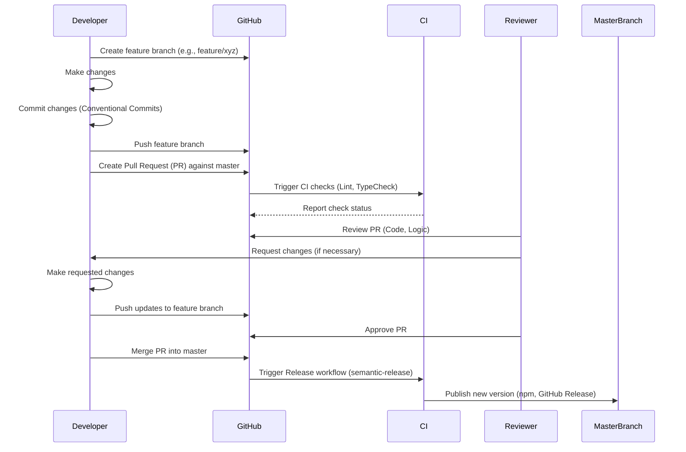

# DocGenius 開発者ドキュメント

## 1. 開発環境のセットアップ方法

### 必要なツールとバージョン

*   **Node.js:** v20 以降 (`README.md`, `.github/workflows/`)
*   **npm:** Node.js に同梱されているバージョン
*   **Git:** バージョン管理システム

### 環境構築手順

1.  **リポジトリのクローン:**
    ```bash
    git clone https://github.com/tkhs0813/docgenius.git
    ```
2.  **プロジェクトディレクトリへ移動:**
    ```bash
    cd docgenius
    ```
3.  **依存関係のインストール:**
    ```bash
    npm install
    ```

### 推奨する開発ツール

*   **コードエディタ:** Visual Studio Code (VS Code) - `.vscode` ディレクトリが `.gitignore` に含まれているため推奨されます。
*   **ターミナル:** 任意のターミナル

## 2. プロジェクトの構造と主要なファイル

### ディレクトリ構成

```text
.
├── .github
│   └── workflows
│       ├── pr-lint.yml         # PR時のLintチェック用GitHub Actionsワークフロー
│       ├── pr-typecheck.yml    # PR時の型チェック用GitHub Actionsワークフロー
│       └── release.yml         # masterブランチへのpush時にリリースを行うGitHub Actionsワークフロー
├── dist/                     # ビルド成果物ディレクトリ (Git管理外)
├── docs
│   └── TODO.md               # 開発タスクリスト
├── node_modules/             # npmパッケージ (Git管理外)
├── src
│   ├── config.ts             # 設定読み込みとデフォルト設定
│   ├── developmentGuide.ts   # ドキュメント生成プロンプトとロジック
│   ├── file.ts               # ファイル検索・保存ユーティリティ
│   ├── index.ts              # CLIアプリケーションのエントリーポイント
│   └── model.ts              # Google GenAIモデルとの連携
├── .gitignore                # Gitが無視するファイル/ディレクトリの指定
├── .prettierrc               # Prettierの設定ファイル
├── CHANGELOG.md              # プロジェクトの変更履歴
├── CONTRIBUTING.md           # 貢献ガイドライン
├── eslint.config.js          # ESLintの設定ファイル
├── package.json              # プロジェクトメタデータ、依存関係、スクリプト
├── README.md                 # プロジェクト概要、使用方法
├── tsconfig.json             # TypeScriptコンパイラ設定
└── tsup.config.ts            # tsup (ビルドツール) の設定ファイル
```

### 主要なファイルの役割

*   **`package.json`**: プロジェクト名、バージョン、依存関係、npmスクリプト（ビルド、リント、フォーマット、リリースなど）を定義します。
*   **`tsconfig.json`**: TypeScriptコンパイラのオプションを設定します。型チェック、出力設定（宣言ファイルの生成など）を制御します。
*   **`tsup.config.ts`**: `tsup`を使用したビルドプロセスを設定します。エントリーポイント、出力フォーマット（CJS, ESM）、ターゲットバージョン、ミニファイなどを指定します。
*   **`eslint.config.js`**: ESLintの設定ファイル。コードの静的解析ルールを定義し、コード品質を維持します。
*   **`.prettierrc`**: Prettierの設定ファイル。コードフォーマッタのルール（インデント、引用符、行末セミコロンなど）を定義します。
*   **`src/index.ts`**: `citty`を使用してCLIインターフェースを定義し、コマンドライン引数を処理するメインのエントリーポイントです。
*   **`src/config.ts`**: アプリケーションの設定（APIキー、出力ディレクトリ、言語など）を管理し、デフォルト値を提供します。
*   **`src/model.ts`**: `@ai-sdk/google`を使用してGoogle Geminiモデルと通信し、プロンプトに基づいてコンテンツを生成します。
*   **`src/file.ts`**: `glob`を使用してプロジェクト内のファイルを検索し、結果をファイルに保存する機能を提供します。
*   **`src/developmentGuide.ts`**: ドキュメント生成のためのプロンプトを作成し、モデルからの応答を処理するロジックを含みます。
*   **`.github/workflows/`**: GitHub Actionsのワークフロー定義。PR時のチェック（Lint, TypeCheck）や`master`ブランチへのマージ時の自動リリース（`semantic-release`を使用）を行います。
*   **`README.md`**: プロジェクトの概要、機能、使用方法、セットアップ手順などを記載した主要なドキュメントです。
*   **`CONTRIBUTING.md`**: プロジェクトへの貢献方法（開発フロー、コーディング規約、PRプロセスなど）を説明します。

### 設定ファイルの解説

*   **`tsconfig.json`**: `strict: true`で厳格な型チェックを有効化。`module: ESNext`, `moduleResolution: node`で最新のモジュールシステムを使用。`target: ES2020`で出力JavaScriptのバージョンを指定。`declaration: true`, `declarationMap: true`, `emitDeclarationOnly: true` (ただし`noEmit: true`が優先されるため実際にはtscでの生成が必要), `sourceMap: true`で型定義ファイルとソースマップの生成を有効化。`skipLibCheck: true`で依存関係の型チェックをスキップ。
*   **`tsup.config.ts`**: `src/index.ts`をエントリーポイントとし、CommonJS (`cjs`) とES Module (`esm`) の両形式で出力。`target: 'es2020'`で出力コードの互換性を指定。`sourcemap: true`, `minify: true`でソースマップ生成とコード圧縮を有効化。
*   **`eslint.config.js`**: TypeScript (`@typescript-eslint/eslint-plugin`), Prettier (`eslint-plugin-prettier`), Import (`eslint-plugin-import`) プラグインを使用。Prettierとの競合を避ける設定 (`eslint-config-prettier`)。`import/order`でimport文の順序を強制。
*   **`.prettierrc`**: セミコロン必須、末尾カンマはes5互換、シングルクォート使用、行幅100文字、タブ幅2スペース、タブ文字不使用、ブラケット間のスペース必須、アロー関数の括弧は可能な限り省略。

## 3. 開発ワークフローとプロセス

### ブランチ戦略

*   **メインブランチ:** `master` (リリースに使用)
*   **フィーチャーブランチ:** `feature/your-feature-name` のような形式で作成 (例: `feature/amazing-feature`)。
*   開発はフィーチャーブランチで行い、完了後に`master`へPull Requestを作成します。

### コミット規約

*   **Conventional Commits** を使用します (`semantic-release`がこれを基にバージョン管理とCHANGELOG生成を行うため)。
*   コミットメッセージの形式: `<type>: <subject>` (例: `feat: add new command`, `fix: resolve API key issue`)
*   主な`<type>`: `feat` (新機能), `fix` (バグ修正), `docs` (ドキュメント変更), `style` (コードスタイル修正), `refactor` (リファクタリング), `test` (テスト追加/修正), `chore` (ビルドプロセスや補助ツールの変更)

### レビュープロセス



1.  `master`ブランチからフィーチャーブランチを作成します。
2.  フィーチャーブランチで開発を行い、Conventional Commitsに従ってコミットします。
3.  フィーチャーブランチをGitHubにプッシュします。
4.  `master`ブランチに対してPull Request (PR) を作成します。
5.  PRが作成されると、GitHub ActionsによるCIチェック（Lint, TypeCheck）が自動的に実行されます。
6.  他の開発者がPRをレビューします。
7.  レビューで指摘があれば修正し、再度プッシュします。
8.  CIチェックが成功し、レビューで承認されたら、PRを`master`ブランチにマージします。
9.  `master`ブランチへのマージをトリガーとして、`semantic-release`による自動リリースプロセスが実行されます。

## 4. コーディング規約とベストプラクティス

### 命名規則

*   **変数、関数:** `camelCase` (例: `apiKey`, `generateDevelopmentGuide`)
*   **クラス、インターフェース、型エイリアス:** `PascalCase` (例: `Config`, `DevelopmentGuideGenerator`, `File`)
*   **定数:** `UPPER_SNAKE_CASE` (例: `FILE_SEPARATOR` - `developmentGuide.ts`内での使用例)
*   **ファイル名:** `kebab-case` または `camelCase` (例: `developmentGuide.ts`, `pr-lint.yml`)

### コードフォーマット

*   **Prettier** によって自動的にフォーマットされます。
*   `npm run format` コマンドで手動フォーマットも可能です。
*   主なルールは `.prettierrc` で定義されています（シングルクォート、セミコロン必須、行幅100など）。

### ドキュメント規約

*   **コードコメント:** 必要に応じてJSDoc形式のコメントを追加します（特に公開APIや複雑なロジック）。
*   **README.md:** プロジェクトの概要、使い方、セットアップ方法などを記載します。
*   **CONTRIBUTING.md:** 開発ワークフローや規約など、貢献者向けの情報を提供します。
*   **CHANGELOG.md:** `semantic-release`によって自動生成されます。手動での編集は不要です。
*   **型定義:** TypeScriptの型を適切に使用し、コードの意図を明確にします。

## 5. デバッグとトラブルシューティング

### ログの確認方法

*   `consola` ライブラリを使用して、処理の開始、情報、成功、エラーメッセージをコンソールに出力します (`src/index.ts`)。
*   実行時にコンソール出力を確認することで、処理の進行状況やエラー発生箇所を特定できます。

### デバッグツールの使用方法

*   **Node.js Inspector:**
    ```bash
    node --inspect ./dist/index.js --apiKey YOUR_API_KEY ...
    ```
    出力されたURLをChromeなどのデバッガ対応ブラウザで開くか、VS Codeのデバッグ機能を使用します。
*   **VS Code Debugger:** VS CodeのデバッグタブからNode.jsプロセスをアタッチしてデバッグできます。`.vscode/launch.json` を設定すると便利です。
*   **Source Maps:** `tsup.config.ts` と `tsconfig.json` でソースマップが有効になっているため、デバッグ時に元のTypeScriptコードを参照できます。

### 一般的な問題の解決方法

*   **APIキーエラー:**
    *   `--apiKey` 引数が正しく指定されているか確認します。
    *   APIキーが有効であるか、Google AI Studio等で確認します。
*   **ファイルが見つからない/読み込めない:**
    *   実行カレントディレクトリが正しいか確認します。
    *   `.gitignore` や `config.ts` の `excludePatterns` で対象ファイルが除外されていないか確認します。
    *   ファイルパスの指定が正しいか確認します。
*   **依存関係エラー:**
    *   `npm install` が正常に完了しているか確認します。
    *   `node_modules` ディレクトリを削除して `npm install` を再実行します (`rm -rf node_modules && npm install`)。
*   **ビルドエラー:**
    *   TypeScriptの型エラーがないか確認します (`npm run typecheck`)。
    *   `tsup` や `tsc` の設定 (`tsup.config.ts`, `tsconfig.json`) が正しいか確認します。
*   **予期しない出力:**
    *   `src/developmentGuide.ts` のプロンプト内容を確認します。
    *   `src/model.ts` でのAPI呼び出しやレスポンス処理を確認します。
    *   `consola` のログ出力を増やして詳細な情報を確認します。

## 6. テスト方法と戦略

### テストの種類と目的

*   **静的型チェック:** TypeScript (`tsc --noEmit`) を使用して、コンパイル前に型エラーを検出します。コードの堅牢性を高めます。
*   **リンティング:** ESLint を使用して、コーディングスタイルや潜在的なバグを検出します。コードの一貫性と品質を維持します。
*   **ユニットテスト/統合テスト:** 現状、具体的なテストコード (`*.test.ts` など) やテストランナーの設定は見当たりませんが、`package.json` に `test` スクリプトが存在し、`CONTRIBUTING.md` でも `npm test` の実行が言及されています。将来的に追加される可能性があります。

### テストの実行方法

*   **型チェック:**
    ```bash
    npm run typecheck
    ```
*   **リンティング:**
    ```bash
    npm run lint
    ```
*   **(将来的な) ユニット/統合テスト:**
    ```bash
    npm test
    ```

### テストカバレッジの要件

*   現時点では、テストカバレッジに関する設定や要件は定義されていません。

## 7. ビルドとデプロイメント

### ビルドプロセス

1.  **ビルドコマンドの実行:**
    ```bash
    npm run build
    ```
2.  **`tsup` によるバンドル:** `tsup.config.ts` の設定に基づき、`src/index.ts` をエントリーポイントとして、CommonJS (`.js`) と ES Module (`.mjs`) 形式のJavaScriptファイルを `dist/` ディレクトリに出力します。ソースマップも生成されます。
3.  **`tsc` による型定義ファイルの生成:** `tsconfig.json` の設定に基づき、TypeScriptコンパイラが型定義ファイル (`.d.ts`) を `dist/` ディレクトリに出力します。
4.  **実行権限の付与:** `prepublishOnly` スクリプト (`package.json`) により、npm公開前に `dist/index.js` に実行権限が付与されます。

### デプロイメントフロー

*   **自動リリース:** `master` ブランチへのプッシュ（通常はPRのマージ）をトリガーとして、GitHub Actions (`.github/workflows/release.yml`) 上で `semantic-release` が実行されます。
*   **`semantic-release` の役割:**
    1.  コミットメッセージ履歴 (Conventional Commits) を分析し、リリースタイプ（メジャー, マイナー, パッチ）を決定します。
    2.  `package.json` のバージョンを更新します。
    3.  `CHANGELOG.md` を自動生成または更新します。
    4.  変更をコミットし、新しいバージョンタグをGitリポジトリに作成します。
    5.  ビルドされたパッケージをnpmレジストリに公開します（`NPM_TOKEN` シークレットが必要）。
    6.  GitHub Releasesにリリースノートを作成します。

### 環境ごとの設定

*   **APIキー:** 実行時に `--apiKey` 引数で指定する必要があります。CI/CD環境では、GitHub Secretsなどを使用して安全に管理する必要があります（例: `NPM_TOKEN`）。
*   **Node.jsバージョン:** 開発環境、CI環境ともにNode.js v20以降が必要です。
*   その他の環境固有の設定は、現時点では特にありません。