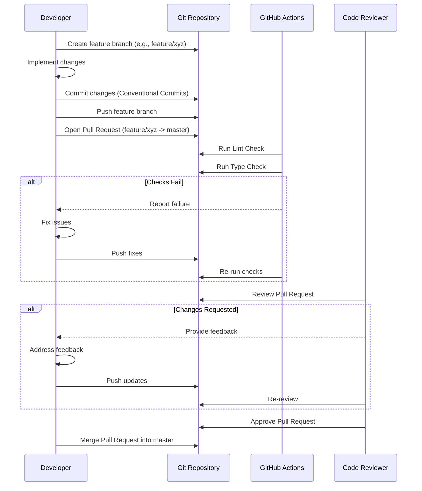
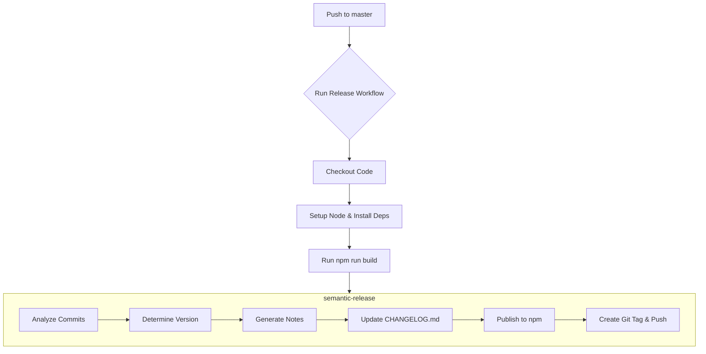

# Developer Documentation

This document provides guidelines and information for developers working on the DocGenius project.

## 1. Development Environment Setup

### Required Tools and Versions

*   **Node.js**: v20 or later (as specified in `README.md` and GitHub Actions workflows)
*   **npm**: Comes bundled with Node.js. Used for package management.
*   **Git**: For version control.

### Environment Setup Procedures

1.  **Clone the repository:**
    ```bash
    git clone https://github.com/tkhs0813/docgenius.git
    ```
2.  **Navigate to the project directory:**
    ```bash
    cd docgenius
    ```
3.  **Install dependencies:**
    ```bash
    npm install
    ```

### Recommended Development Tools

*   **Visual Studio Code (VS Code)**: A popular code editor with excellent TypeScript support.
*   **ESLint Extension**: Integrates ESLint into VS Code for real-time linting.
*   **Prettier Extension**: Integrates Prettier for automatic code formatting.
*   **tsx**: For running TypeScript files directly during development (`package.json` scripts, `README.md`).

## 2. Project Structure and Key Files

```plaintext
.
├── .github
│   └── workflows
│       ├── pr-lint.yml       # GitHub Action: Lint check on Pull Requests
│       ├── pr-typecheck.yml  # GitHub Action: Type check on Pull Requests
│       └── release.yml       # GitHub Action: Automated release process
├── .gitignore              # Specifies intentionally untracked files that Git should ignore
├── .prettierrc             # Configuration file for Prettier code formatter
├── CHANGELOG.md            # History of changes made to the project
├── CONTRIBUTING.md         # Guidelines for contributing to the project
├── README.md               # Project overview, usage instructions, and basic setup
├── docs
│   └── TODO.md             # Internal TODO list for feature development
├── eslint.config.js        # Configuration file for ESLint
├── package-lock.json       # Records exact versions of dependencies
├── package.json            # Project metadata, dependencies, and npm scripts
├── src
│   ├── config.ts           # Loads and defines project configuration
│   ├── developmentGuide.ts # Generates prompts for AI documentation generation
│   ├── file.ts             # Handles file system operations (finding files, saving output)
│   ├── index.ts            # Main entry point for the CLI application (using citty)
│   └── model.ts            # Interface for interacting with the AI model (Google Gemini)
├── tsconfig.json           # TypeScript compiler options
└── tsup.config.ts          # Configuration for tsup (bundler for TypeScript)
```

### Key File Roles

*   **`package.json`**: Defines project metadata, dependencies (`dependencies`, `devDependencies`), and scripts (`scripts`) for tasks like building, linting, formatting, and releasing.
*   **`src/index.ts`**: The main entry point for the `docgenius` CLI tool. It uses `citty` to define commands and arguments, orchestrates the documentation generation process by calling other modules.
*   **`src/config.ts`**: Manages configuration settings, including default values and loading configuration based on CLI arguments (API key, output directory, language).
*   **`src/model.ts`**: Handles communication with the Google Generative AI API (Gemini 2.5 Pro). It defines the expected output schema (`zod`) and sends prompts to the AI model.
*   **`src/developmentGuide.ts`**: Constructs the specific prompts sent to the AI model based on the analyzed code files and required documentation type (e.g., development guide).
*   **`src/file.ts`**: Contains utility functions for finding relevant source files (`glob`) based on configured patterns and exclusions, reading their content, and saving the generated documentation.
*   **`tsup.config.ts`**: Configures `tsup` to bundle the TypeScript source code into CommonJS (`cjs`) and ES Module (`esm`) formats for distribution, including options for minification, sourcemaps, and cleaning.
*   **`tsconfig.json`**: Specifies TypeScript compiler options, defining the target JavaScript version (`ES2020`), module system (`ESNext`), enabling strict type checking (`strict: true`), and configuring declaration file generation.
*   **`eslint.config.js`**: Configures ESLint for code linting, integrating TypeScript support (`@typescript-eslint`), Prettier (`eslint-plugin-prettier`), and import sorting (`eslint-plugin-import`).
*   **`.prettierrc`**: Defines code formatting rules enforced by Prettier.
*   **`.github/workflows/`**: Contains GitHub Actions workflows for CI/CD, including linting, type checking on pull requests, and automated releases to npm on pushes to the `master` branch.

### Configuration File Explanations

*   **`tsconfig.json`**: Configures the TypeScript compiler. Key settings include `target: "ES2020"`, `module: "ESNext"`, `strict: true`, `esModuleInterop: true`, `skipLibCheck: true`. It specifies input files (`include`) and exclusions (`exclude`). Note that `noEmit: true` is set, as the actual build is handled by `tsup`, but `tsc` is used for type checking and declaration file generation (`declaration: true`, `emitDeclarationOnly: true` in `package.json` build script).
*   **`tsup.config.ts`**: Configures the `tsup` bundler. It defines the entry point (`src/index.ts`), output formats (`cjs`, `esm`), target environment (`es2020`), and enables features like cleaning the output directory (`clean: true`), minification (`minify: true`), and sourcemaps (`sourcemap: true`).
*   **`eslint.config.js`**: Sets up ESLint rules using the flat config format. It enables recommended rules from ESLint and TypeScript ESLint, integrates Prettier rules, and defines custom rules like import ordering.
*   **`.prettierrc`**: Specifies formatting preferences like semicolon usage, trailing commas, quote style, print width, and tab width.
*   **`package.json` (`release` section)**: Configures `semantic-release` for automated versioning and package publishing based on Conventional Commits.

## 3. Development Workflow and Process

### Branch Strategy

The project follows a feature branch workflow as outlined in `CONTRIBUTING.md`:

1.  Create a new branch from `master` for new features or bug fixes (e.g., `feature/your-feature-name` or `fix/issue-description`).
2.  Develop the feature or fix on this branch.
3.  Once complete, push the branch and open a Pull Request (PR) against the `master` branch.

### Commit Conventions

The project uses [Conventional Commits](https://www.conventionalcommits.org/). This is enforced by `semantic-release` for automated changelog generation and version bumping. Examples from `CONTRIBUTING.md` and `CHANGELOG.md`:

*   `feat: add your feature`
*   `fix: resolve an issue`

### Review Process

1.  **Pull Request (PR)**: Once development on a feature branch is complete, the developer creates a PR targeting the `master` branch.
2.  **Automated Checks**: GitHub Actions automatically run linting (`pr-lint.yml`) and type checking (`pr-typecheck.yml`) on the PR.
3.  **Code Review**: Other developers review the code for correctness, style, and adherence to project standards.
4.  **Discussion & Updates**: The PR author addresses feedback and makes necessary changes.
5.  **Merge**: Once the PR is approved and all checks pass, it is merged into the `master` branch.



## 4. Coding Standards and Best Practices

### Naming Conventions

*   Follow standard TypeScript/JavaScript naming conventions (e.g., `camelCase` for variables and functions, `PascalCase` for classes and types).
*   Adhere to rules enforced by ESLint.

### Code Formatting

*   Code formatting is strictly enforced by **Prettier**. Configuration is defined in `.prettierrc`.
*   Run `npm run format` to automatically format code and fix linting issues.
*   Linting is checked via `npm run lint` and enforced in CI (`.github/workflows/pr-lint.yml`).

### Documentation Standards

*   **README.md**: Keep updated with project overview, usage, and basic setup.
*   **CONTRIBUTING.md**: Defines how others can contribute.
*   **CHANGELOG.md**: Automatically generated by `semantic-release` based on commit messages.
*   **Code Comments**: Use JSDoc-style comments for explaining complex logic, function parameters, and return types where necessary, although not extensively used in the current codebase.
*   **TypeScript Types**: Use clear and descriptive types to improve code readability and maintainability.

## 5. Debugging and Troubleshooting

### Log Checking Methods

*   The project uses the `consola` library for logging within the CLI (`src/index.ts`). Check the console output when running `docgenius` for informational messages, warnings, and errors.
*   Increase verbosity or add more `consola` logs during development if needed.

### Debug Tool Usage

*   **Node.js Inspector**: Run the application with the `--inspect` flag:
    ```bash
    node --inspect ./node_modules/.bin/tsx ./src/index.ts --apiKey YOUR-API-KEY
    ```
    Then connect using Chrome DevTools (`chrome://inspect`) or VS Code's debugger.
*   **VS Code Debugger**: Configure a `launch.json` file to debug the application directly within VS Code.
*   **`tsx`**: Use `tsx` for running TypeScript files directly during development, which simplifies the debugging loop compared to building first.
    ```bash
    tsx ./src/index.ts --apiKey YOUR-API-KEY
    ```

### Common Issue Resolution

*   **Invalid API Key**: Ensure the `--apiKey` provided is correct and has access to the Google Gemini API.
*   **Configuration Errors**: Double-check CLI arguments (`--output`, `--language`).
*   **Dependency Issues**: Run `npm install` or `npm ci` if encountering module resolution errors.
*   **Build Failures**: Check `tsup` and `tsc` logs for errors during the `npm run build` process.
*   **Type Errors**: Run `npm run typecheck` to identify TypeScript errors.
*   **File Access/Permissions**: Ensure the process has read access to source files and write access to the specified output directory.

## 6. Testing Methods and Strategy

### Test Types and Purposes

*   **Linting**: Static code analysis using ESLint (`eslint.config.js`) to enforce code style and catch potential errors. Purpose: Maintain code quality and consistency.
*   **Type Checking**: Static type checking using the TypeScript compiler (`tsconfig.json`). Purpose: Catch type-related errors during development and ensure type safety.
*   **Manual Testing**: Running the CLI tool with various inputs and codebases to verify functionality.
*   *(Note: The project currently lacks automated unit or integration tests, although `CONTRIBUTING.md` mentions `npm test`, no corresponding script exists in `package.json`)*

### Test Execution Methods

*   **Linting**: `npm run lint`
*   **Type Checking**: `npm run typecheck`
*   **CI Checks**: Linting and type checking are automatically executed on Pull Requests via GitHub Actions (`.github/workflows/pr-lint.yml`, `.github/workflows/pr-typecheck.yml`).

### Test Coverage Requirements

*   There are no explicit test coverage requirements defined or measured in the project currently.
*   Passing linting and type checks is mandatory for merging Pull Requests.

## 7. Build and Deployment

### Build Process

1.  The build process is triggered by running `npm run build`.
2.  This script executes two main steps defined in `package.json`:
    *   `tsup`: Bundles the TypeScript code from `src/` into CommonJS (`.js`) and ES Module (`.mjs`) formats in the `dist/` directory, according to `tsup.config.ts`.
    *   `tsc --emitDeclarationOnly --outDir dist`: Generates TypeScript declaration files (`.d.ts`) in the `dist/` directory based on `tsconfig.json`.
3.  The `prepublishOnly` script in `package.json` ensures the main executable (`dist/index.js`) has execute permissions before publishing.

### Deployment Flow

*   Deployment is automated using `semantic-release` and GitHub Actions.
*   The workflow is defined in `.github/workflows/release.yml`.
*   **Trigger**: Pushing commits to the `master` branch.
*   **Process**:
    1.  The `release` job checks out the code.
    2.  Sets up Node.js and installs dependencies.
    3.  Runs the build process (`npm run build`).
    4.  Executes `npx semantic-release`:
        *   Analyzes commits since the last release using `@semantic-release/commit-analyzer` (based on Conventional Commits).
        *   Determines the next semantic version.
        *   Generates release notes using `@semantic-release/release-notes-generator`.
        *   Updates `CHANGELOG.md` using `@semantic-release/changelog`.
        *   Updates `package.json` version and publishes the package to npm using `@semantic-release/npm` (requires `NPM_TOKEN` secret).
        *   Creates a Git tag for the new version and pushes changes (version update, changelog) back to the repository using `@semantic-release/git` (requires `GITHUB_TOKEN` secret).



### Environment-Specific Settings

*   The application primarily relies on command-line arguments for configuration rather than environment variables or `.env` files.
*   **`apiKey`**: Google GenAI API key, passed via `--apiKey` argument. This is essential for the core functionality.
*   **`output`**: Output directory for generated documentation, passed via `--output` argument (defaults to `./output`).
*   **`language`**: Language for documentation generation ('en' or 'ja'), passed via `--language` argument (defaults to 'en').
*   **CI/CD Environment**: The release workflow (`.github/workflows/release.yml`) requires `GITHUB_TOKEN` and `NPM_TOKEN` secrets to be configured in the GitHub repository settings for authentication with GitHub and npm respectively.