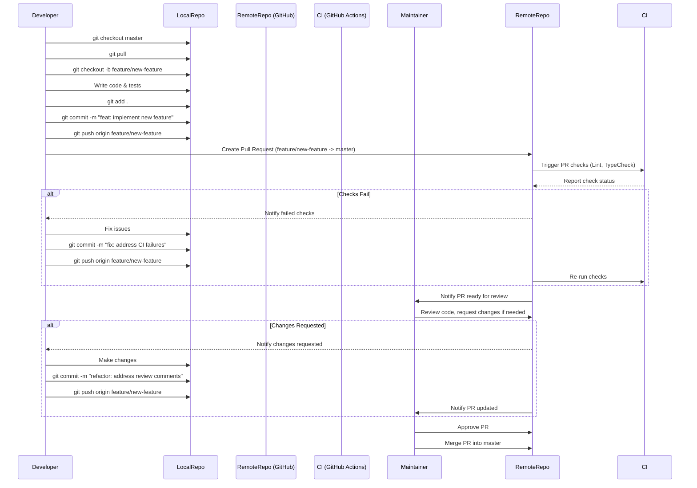
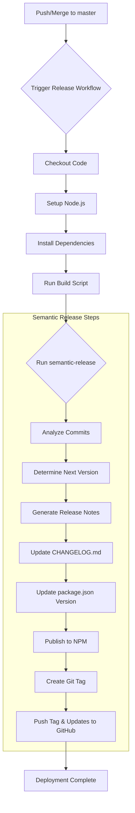

# DocGenius Developer Documentation

This document provides essential information for developers working on the DocGenius project.

## 1. Development Environment Setup

### Required Tools and Versions

- **Node.js**: v20 or later (as specified in `.github/workflows/pr-typecheck.yml` and `pr-lint.yml`, v22 used in `release.yml`)
- **npm**: Version compatible with Node.js v20+ (usually bundled with Node.js)
- **Git**: Standard version control system.

### Environment Setup Procedures

1.  **Clone the repository:**

    ```bash
    git clone https://github.com/tkhs0813/docgenius.git
    cd docgenius
    ```

2.  **Install dependencies:**

    ```bash
    npm install
    ```

    Or using `npm ci` for clean installs, especially in CI environments:

    ```bash
    npm ci
    ```

3.  **API Key:** For running the application locally (e.g., using `npm run dev`), you'll need a Google GenAI API key. This can be passed as an argument or set up as an environment variable depending on your local setup modifications. The primary way shown in `README.md` is via command line argument:
    ```bash
    # Example using the dev script
    npm run dev -- --apiKey YOUR_API_KEY --output ./dev-output
    ```

### Recommended Development Tools

- **IDE**: Visual Studio Code (VS Code) is recommended. The project includes settings ignored via `.gitignore` (`.vscode/`).
- **Extensions (VS Code)**:
  - ESLint: For integrating ESLint checks into the editor.
  - Prettier - Code formatter: For integrating Prettier formatting.
  - TypeScript Language Features: Built-in VS Code extension for TypeScript support.

## 2. Project Structure and Key Files

### Directory Structure

```
.
├── .github
│   └── workflows
│       ├── pr-lint.yml        # GitHub Actions workflow for PR linting
│       ├── pr-typecheck.yml   # GitHub Actions workflow for PR type checking
│       └── release.yml        # GitHub Actions workflow for automated releases
├── dist/                      # Compiled output directory (generated by build)
├── docs
│   └── TODO.md                # Internal TODO list for feature development
├── node_modules/              # Project dependencies
├── src                        # Source code directory
│   ├── config.ts              # Configuration loading and defaults
│   ├── developmentGuide.ts    # Logic for generating prompts for AI model
│   ├── file.ts                # File system operations (finding, saving)
│   ├── index.ts               # Main application entry point (CLI definition)
│   └── model.ts               # Interaction with the Google GenAI API
├── .gitignore                 # Specifies intentionally untracked files
├── .prettierrc                # Prettier configuration file
├── CHANGELOG.md               # Automatically generated changelog
├── CONTRIBUTING.md            # Guidelines for contributing to the project
├── eslint.config.js           # ESLint configuration file
├── package.json               # Project metadata, dependencies, and scripts
├── README.md                  # Project overview and user guide
├── tsconfig.json              # TypeScript compiler configuration
└── tsup.config.ts             # tsup (bundler) configuration
```

### Key File Roles

- `package.json`: Defines project metadata, dependencies (`dependencies`, `devDependencies`), scripts (`scripts` section for build, lint, test, dev), and release configuration (`semantic-release`). Also specifies the entry points (`main`, `module`, `types`, `bin`).
- `src/index.ts`: The main entry point for the CLI tool. Uses `citty` to define the command-line interface and orchestrates the core logic: loading configuration, finding files, interacting with the AI model, and saving the output.
- `src/config.ts`: Defines the `Config` type and provides default values for file extensions to include, patterns to exclude, maximum files to process, and loads configuration based on CLI arguments.
- `src/model.ts`: Handles communication with the Google GenAI API (`gemini-2.5-pro-exp-03-25` model specifically). Encapsulates the API call logic.
- `src/developmentGuide.ts`: Contains functions to generate the specific prompts sent to the AI model for generating development and setup guides, based on the collected file contents and target language.
- `src/file.ts`: Provides utility functions to find relevant project files using `glob` based on configured patterns and exclusion rules, and to save the generated documentation.
- `tsup.config.ts`: Configures `tsup` for bundling the TypeScript source code into CommonJS (`cjs`) and ESModule (`esm`) formats for distribution. Defines entry points, target ECMAScript version, sourcemaps, minification, etc.
- `tsconfig.json`: Configures the TypeScript compiler (`tsc`), primarily used here for type checking (`"noEmit": true`) and generating declaration files (`.d.ts`) during the build process (`"declaration": true`, `"emitDeclarationOnly": true`). Enforces strict type checking (`"strict": true`).
- `eslint.config.js`: Configures ESLint for static code analysis, enforcing coding standards and identifying potential issues. Integrates TypeScript ESLint, Prettier, and Import Plugin rules.
- `.prettierrc`: Defines code formatting rules enforced by Prettier.
- `.github/workflows/`: Contains GitHub Actions workflows for CI/CD:
  - `pr-lint.yml`: Runs lint checks on pull requests.
  - `pr-typecheck.yml`: Runs TypeScript type checks on pull requests.
  - `release.yml`: Automates the release process (build, versioning, NPM publish) using `semantic-release` when changes are merged to the `master` branch.

### Configuration File Explanations

- **`tsconfig.json`**:
  - `target: "ES2020"`: Compiles TypeScript to ECMAScript 2020 JavaScript.
  - `module: "ESNext"`: Uses modern ES module syntax.
  - `moduleResolution: "node"`: Specifies Node.js style module resolution.
  - `strict: true`: Enables all strict type-checking options.
  - `esModuleInterop: true`: Improves compatibility between CommonJS and ES modules.
  - `skipLibCheck: true`: Skips type checking of declaration files (`.d.ts`), speeding up compilation.
  - `outDir: "./dist"`: Specifies the output directory for emitted files (used mainly for declaration files here).
  - `noEmit: true`: Prevents emitting JavaScript files by `tsc` (bundling is handled by `tsup`).
  - `declaration: true`, `declarationMap: true`, `emitDeclarationOnly: true`: Instructs `tsc` to generate type declaration files (`.d.ts`) and their sourcemaps in the `dist` directory.
  - `include`, `exclude`: Define which files are included/excluded in the TypeScript project compilation context.
- **`tsup.config.ts`**:
  - `entry: ['src/index.ts']`: Specifies the main entry point for bundling.
  - `format: ['cjs', 'esm']`: Outputs both CommonJS and ESModule formats.
  - `target: 'es2020'`: Ensures bundled code is compatible with ES2020 environments.
  - `dts: false`: Disables `tsup`'s built-in DTS generation (handled by `tsc` via `package.json` script).
  - `sourcemap: true`: Generates sourcemaps for easier debugging.
  - `minify: true`: Minifies the output code for production.
  - `clean: true`: Cleans the output directory before building.
  - `splitting: false`: Prevents code splitting into multiple chunks.
  - `treeshake: true`: Enables tree shaking to remove unused code.
- **`eslint.config.js`**: Defines linting rules using a flat config format. It enables recommended rules from ESLint and TypeScript ESLint, integrates Prettier for formatting checks (`eslint-plugin-prettier`, `eslint-config-prettier`), and enforces import order using `eslint-plugin-import`.
- **`.prettierrc`**: Configures Prettier with specific formatting options like using single quotes, adding trailing commas where appropriate (`es5`), setting print width to 100 characters, and using spaces instead of tabs.

## 3. Development Workflow and Process

### Branch Strategy

The project follows a feature branch workflow:

1.  Create a new branch from the `master` branch for new features or bug fixes.
2.  Branch names should be descriptive, typically prefixed with `feature/` or `fix/` (e.g., `feature/add-new-model-support`, `fix/resolve-api-error`).
    ```bash
    git checkout master
    git pull origin master
    git checkout -b feature/your-feature-name
    ```
3.  Develop the feature or fix on this branch.
4.  Once complete, push the branch and open a Pull Request (PR) against the `master` branch.

### Commit Conventions

The project uses [Conventional Commits](https://www.conventionalcommits.org/). This convention is essential as it's used by `semantic-release` to automate versioning and changelog generation.

Common commit types include:

- `feat`: A new feature.
- `fix`: A bug fix.
- `docs`: Documentation only changes.
- `style`: Changes that do not affect the meaning of the code (white-space, formatting, missing semi-colons, etc).
- `refactor`: A code change that neither fixes a bug nor adds a feature.
- `perf`: A code change that improves performance.
- `test`: Adding missing tests or correcting existing tests.
- `build`: Changes that affect the build system or external dependencies (example scopes: gulp, broccoli, npm).
- `ci`: Changes to our CI configuration files and scripts (example scopes: Travis, Circle, BrowserStack, SauceLabs).
- `chore`: Other changes that don't modify `src` or `test` files.

Example commit message:

```
feat: add support for Japanese language output

Implement prompt generation and configuration options for Japanese documentation output.
```

### Review Process

1.  **Create Pull Request (PR)**: Once development on a feature branch is complete, push the branch to GitHub and open a PR against the `master` branch. Ensure the PR description clearly explains the changes and references any related issues.
2.  **Automated Checks**: GitHub Actions automatically run linting (`pr-lint.yml`) and type checking (`pr-typecheck.yml`) on the PR. These checks must pass.
3.  **Code Review**: Project maintainers or other contributors will review the code for correctness, adherence to standards, and overall quality.
4.  **Address Feedback**: Incorporate any feedback received during the review process by pushing additional commits to the feature branch.
5.  **Merge**: Once the PR is approved and all checks pass, it will be merged into the `master` branch by a maintainer.

### Development Workflow Diagram



## 4. Coding Standards and Best Practices

### Naming Conventions

- **TypeScript/JavaScript**: Follow standard JavaScript/TypeScript naming conventions (e.g., `camelCase` for variables and functions, `PascalCase` for classes and types/interfaces).
- **Files**: Use `kebab-case` for filenames (e.g., `development-guide.ts`) where appropriate, or `camelCase`/`PascalCase` depending on context (e.g., configuration files like `eslint.config.js`).
- **Branches**: Use prefixes like `feature/`, `fix/`, `chore/` followed by a descriptive `kebab-case` name.

### Code Formatting

- **Prettier**: Code formatting is strictly enforced using Prettier. Configuration is defined in `.prettierrc`.
- **Automatic Formatting**: It's recommended to configure your IDE to format code on save using Prettier.
- **Linting Integration**: Prettier rules are integrated into the ESLint configuration (`eslint.config.js`) via `eslint-plugin-prettier` and `eslint-config-prettier`. Run `npm run format` to format code and fix auto-fixable lint issues.

### Documentation Standards

- **Code Comments**: Use TSDoc/JSDoc comments for explaining complex logic, function signatures, types, and interfaces where necessary.
- **README.md**: Keep the main `README.md` updated with project overview, usage instructions, and requirements.
- **CONTRIBUTING.md**: Contains guidelines for contributors.
- **Commit Messages**: Follow the Conventional Commits specification.
- **PR Descriptions**: Provide clear descriptions of changes in Pull Requests.

## 5. Debugging and Troubleshooting

### Log Checking Methods

- **Console Logging**: The application uses `consola` for logging (`src/index.ts`). During development or troubleshooting, add more `consola.info()`, `consola.debug()`, `consola.warn()`, or `consola.error()` statements as needed. Standard output/error streams capture these logs.
- **Verbosity**: Adjust log verbosity if needed (though `consola`'s default levels are usually sufficient).

### Debug Tool Usage

- **Node.js Inspector**: Run the application with the `--inspect` or `--inspect-brk` flag to enable debugging via Chrome DevTools or VS Code debugger.
  ```bash
  # Example using dev script with inspect-brk (pauses at start)
  node --inspect-brk ./node_modules/.bin/tsx ./src/index.ts --apiKey YOUR_API_KEY --output ./debug-output
  ```
- **VS Code Debugger**: Configure `launch.json` in the `.vscode` directory to easily launch and debug the application directly from VS Code. A simple configuration might look like this:
  ```json
  // .vscode/launch.json
  {
    "version": "0.2.0",
    "configurations": [
      {
        "type": "node",
        "request": "launch",
        "name": "Launch DocGenius",
        "runtimeArgs": ["-r", "tsx/register"],
        "args": ["./src/index.ts", "--apiKey", "YOUR_API_KEY", "--output", "./debug-output"],
        "skipFiles": ["<node_internals>/**"],
        "console": "integratedTerminal"
      }
    ]
  }
  ```
  _Remember to replace `"YOUR_API_KEY"` or handle it securely._

### Common Issue Resolution

- **API Key Errors**: Ensure the correct Google GenAI API key is provided via the command line argument (`apiKey`) and that it has the necessary permissions. Check for typos or incorrect key values. The model used (`gemini-2.5-pro-exp-03-25`) might require specific API access or project enablement.
- **File Access Issues**: Verify that the tool has read permissions for the project files and write permissions for the specified output directory. Check `excludePatterns` in `src/config.ts` if expected files are not being processed.
- **Dependency Problems**: Run `npm install` or `npm ci` to ensure all dependencies are correctly installed. Delete `node_modules` and `package-lock.json` and reinstall if persistent issues occur.
- **Build Failures**: Check the output of `npm run build` for specific errors from `tsup` or `tsc`. Common causes include TypeScript type errors or configuration issues.
- **Type Errors**: Run `npm run typecheck` to identify TypeScript errors. Ensure code conforms to the types defined and the strict settings in `tsconfig.json`.

## 6. Testing Methods and Strategy

### Test Types and Purposes

- **Static Analysis (Linting)**: Enforced via ESLint (`npm run lint`). Catches code style issues, potential bugs, and enforces formatting consistency. Configuration in `eslint.config.js`.
- **Type Checking**: Enforced via TypeScript Compiler (`npm run typecheck`). Catches type-related errors during development, improving code robustness. Configuration in `tsconfig.json`.
- **Unit/Integration Tests**: (Currently not implemented) The `CONTRIBUTING.md` mentions running tests (`npm test`), but there are no test files or test runner configurations (`jest`, `vitest`, etc.) in the provided codebase or `package.json`. Implementing unit tests for individual functions (e.g., prompt generation, file filtering) and integration tests for the end-to-end flow would be beneficial.

### Test Execution Methods

- **Linting**:
  ```bash
  npm run lint
  ```
- **Type Checking**:
  ```bash
  npm run typecheck
  ```
- **Formatting Check/Fix**:
  ```bash
  npm run format
  ```
- **CI Checks**: Linting and type checking are automatically run on Pull Requests via GitHub Actions (`.github/workflows/pr-lint.yml`, `.github/workflows/pr-typecheck.yml`).

### Test Coverage Requirements

- Currently, there are no automated unit or integration tests, and therefore no test coverage requirements are enforced.
- Adding a testing framework and setting coverage goals (e.g., using Istanbul/nyc) is a potential area for future improvement.

## 7. Build and Deployment

### Build Process

1.  **Command**: The build process is triggered by running:
    ```bash
    npm run build
    ```
2.  **Steps**: The `build` script in `package.json` executes two main commands:
    - `tsup`: Bundles the code from `src/index.ts` into `dist/index.js` (CommonJS) and `dist/index.mjs` (ES Module), including sourcemaps and minification, based on `tsup.config.ts`.
    - `tsc --emitDeclarationOnly --outDir dist`: Uses the TypeScript compiler to generate type declaration files (`.d.ts`) and their maps (`.d.ts.map`) in the `dist` directory, based on `tsconfig.json`.
3.  **Output**: The final distributable package contents are placed in the `dist/` directory.
4.  **Permissions**: The `prepublishOnly` script in `package.json` ensures the main CLI entry point (`dist/index.js`) has execute permissions before publishing.

### Deployment Flow

Deployment is handled automatically via `semantic-release` integrated with GitHub Actions.

1.  **Trigger**: A push or merge to the `master` branch triggers the `Release` workflow (`.github/workflows/release.yml`).
2.  **CI Job**: The `release` job runs on an `ubuntu-latest` runner.
3.  **Checkout & Setup**: The code is checked out, and Node.js (v22) is set up.
4.  **Install Dependencies**: `npm ci` installs dependencies.
5.  **Build**: `npm run build` creates the distributable files in `dist/`.
6.  **Semantic Release**: `npx semantic-release` runs:
    - Analyzes commits since the last release using Conventional Commits convention (`@semantic-release/commit-analyzer`).
    - Determines the next semantic version number.
    - Generates release notes based on commits (`@semantic-release/release-notes-generator`).
    - Updates the `CHANGELOG.md` file (`@semantic-release/changelog`).
    - Updates the `package.json` version.
    - Publishes the new version to NPM using the `NPM_TOKEN` secret (`@semantic-release/npm`).
    - Creates a Git tag for the new version and pushes the tag and updated `package.json`/`CHANGELOG.md` back to the repository (`@semantic-release/git`).

### Deployment Workflow Diagram



### Environment-Specific Settings

- **API Key**: The Google GenAI API key is the main environment-specific setting required at runtime. It's passed as a command-line argument (`apiKey`) rather than through environment variables in the current implementation (`src/index.ts`).
- **Deployment Tokens**:
  - `GITHUB_TOKEN`: Automatically provided by GitHub Actions, used by `semantic-release` to push tags and updates back to the repository.
  - `NPM_TOKEN`: Must be configured as a secret (`NPM_TOKEN`) in the GitHub repository settings. Used by `semantic-release` to authenticate with NPM for publishing the package.
