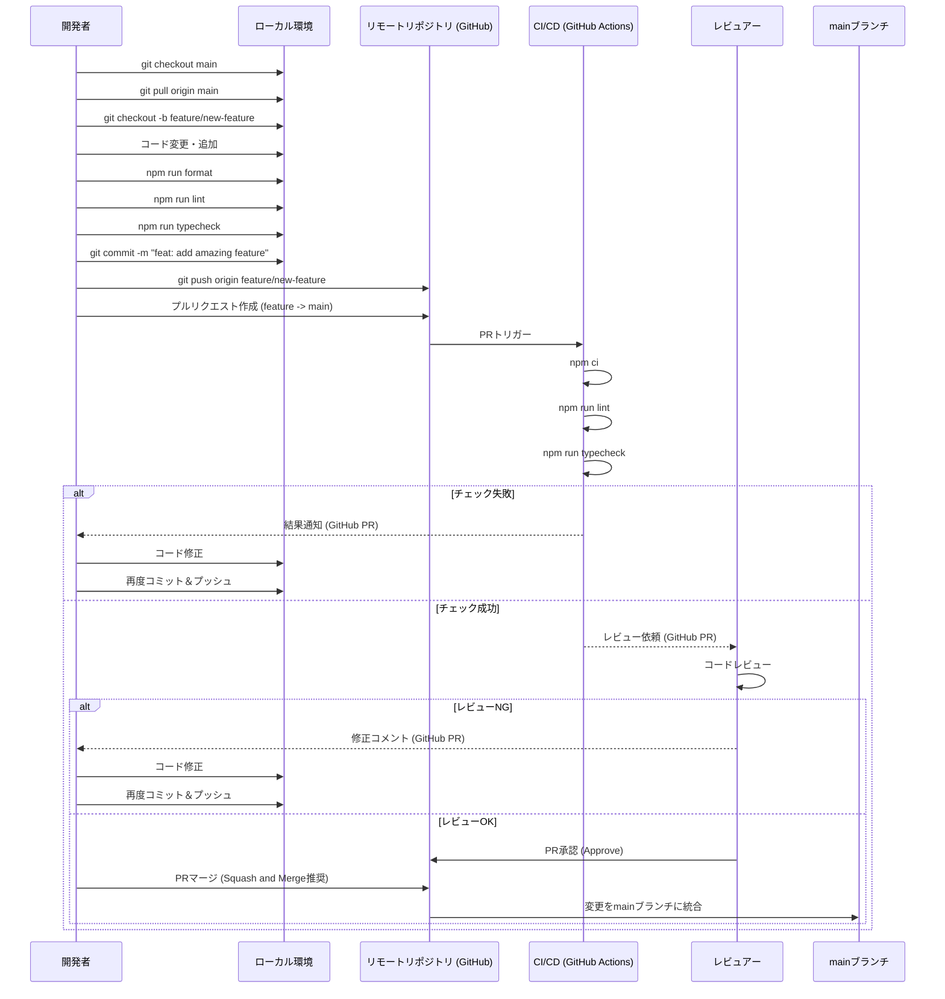

# Blueprint AI 開発ドキュメント

## 1. 開発環境のセットアップ方法

### 1.1 必要なツールとバージョン

- **Node.js:** v20 以上 (`package.json`, `.github/workflows/*.yml`)
- **npm:** Node.jsに同梱されるバージョン (v10以上推奨)
- **Git:** バージョン管理システム
- **Google GenAI APIキー:** Gemini 2.5 Pro モデルへのアクセス権限を持つAPIキー (`README.md`, `src/model.ts`)

### 1.2 環境構築手順

1.  **リポジトリのクローン:**
    ```bash
    git clone https://github.com/your-username/blueprint-ai.git
    cd blueprint-ai
    ```

2.  **依存関係のインストール:**
    ```bash
    npm install
    ```

3.  **APIキーの設定:**
    開発時には、コマンドライン引数でAPIキーを渡すか、環境変数などで設定する必要があります。
    ```bash
    npm run dev --apikey YOUR-API-KEY
    ```

### 1.3 推奨する開発ツール

- **VS Code:** 推奨エディタ。以下の拡張機能があると便利です。
    - ESLint
    - Prettier - Code formatter
    - EditorConfig for VS Code
    - Mermaid Markdown Syntax Highlighting (Mermaid図のプレビュー用)
- **tsx:** TypeScriptファイルを直接実行するためのツール (`package.json`)
- **ESLint:** コードの静的解析 (`package.json`, `eslint.config.js`)
- **Prettier:** コードフォーマッター (`package.json`, `.prettierrc`)

## 2. プロジェクトの構造と主要なファイル

### 2.1 ディレクトリ構成

```
blueprint-ai/
├── .github/                # GitHub Actions ワークフロー
│   └── workflows/
│       ├── pr-lint.yml     # プルリクエスト時のLintチェック
│       └── pr-typecheck.yml # プルリクエスト時の型チェック
├── docs/                   # プロジェクトドキュメント（TODOリストなど）
│   └── TODO.md
├── node_modules/           # npm パッケージ (Git管理外)
├── output/                 # 生成されたドキュメントの出力先 (デフォルト、Git管理外)
├── src/                    # メインのソースコード
│   ├── config.ts           # 設定読み込み、デフォルト設定
│   ├── developmentGuide.ts # 開発ドキュメント生成ロジック
│   ├── file.ts             # ファイル検索、読み込み、保存処理
│   ├── index.ts            # CLIのエントリーポイント、コマンド定義
│   └── model.ts            # Google GenAIモデルとの連携
├── .gitignore              # Gitで追跡しないファイル/ディレクトリを指定
├── .prettierrc             # Prettierの設定ファイル
├── CHANGELOG.md            # プロジェクトの変更履歴
├── CONTRIBUTING.md         # 貢献ガイドライン
├── eslint.config.js        # ESLintの設定ファイル
├── package-lock.json       # 依存関係のロックファイル
├── package.json            # プロジェクト情報、依存関係、スクリプト定義
├── README.md               # プロジェクト概要、基本的な使い方
└── tsconfig.json           # TypeScriptコンパイラの設定
```

### 2.2 主要なファイルの役割

-   **`package.json`**: プロジェクトのメタデータ、依存ライブラリ、実行可能なスクリプト (`dev`, `lint`, `format`, `typecheck`) を定義します。
-   **`tsconfig.json`**: TypeScriptのコンパイルオプションを指定します。`target: es2022`, `module: ESNext`, `strict: true`などが設定されています。
-   **`eslint.config.js`**: ESLintの設定ファイル。TypeScript用のルール、Prettier連携、import順序などが定義されています。
-   **`.prettierrc`**: Prettierのフォーマットルールを定義します。
-   **`src/index.ts`**: `citty`を使用したCLIアプリケーションのエントリーポイントです。コマンドライン引数の解析、設定の読み込み、各モジュールの呼び出しを行います。
-   **`src/config.ts`**: アプリケーションの設定（対象ファイル拡張子、除外パターン、APIキーなど）を管理します。デフォルト設定とコマンドライン引数からの読み込みを行います。
-   **`src/file.ts`**: `glob`を使用して指定されたディレクトリからファイルを検索し、内容を読み込む機能、および生成されたドキュメントを保存する機能を提供します。
-   **`src/model.ts`**: `@google/genai`ライブラリを使用してGoogle GenAI API (Gemini 2.5 Pro) と通信し、プロンプトに基づいてコンテンツを生成する機能を提供します。
-   **`src/developmentGuide.ts`**: 開発ドキュメント生成のためのプロンプト作成と、モデルからの応答を整形する機能を提供します。
-   **`CONTRIBUTING.md`**: プロジェクトへの貢献方法、開発ワークフロー、コーディング規約などを記載しています。
-   **`README.md`**: プロジェクトの概要、特徴、インストール方法、基本的な使用方法を記載しています。

### 2.3 設定ファイルの解説

-   **`tsconfig.json`**:
    -   `target: "es2022"`: 生成するJavaScriptのバージョンを指定します。
    -   `module: "ESNext"`: 最新のECMAScriptモジュールシステムを使用します。
    -   `moduleResolution: "bundler"`: Node.jsの最新のモジュール解決戦略に準拠します。
    -   `esModuleInterop: true`: CommonJSモジュールとの相互運用性を向上させます。
    -   `forceConsistentCasingInFileNames: true`: ファイル名の大文字小文字を区別します。
    -   `strict: true`: すべての厳格な型チェックオプションを有効にします。
    -   `skipLibCheck: true`: 依存関係の型定義ファイルのチェックをスキップし、ビルド時間を短縮します。
-   **`eslint.config.js`**:
    -   TypeScript ESLintプラグイン (`@typescript-eslint/eslint-plugin`) を使用してTypeScript固有のルールを適用します。
    -   Prettierプラグイン (`eslint-plugin-prettier`) と設定 (`eslint-config-prettier`) を統合し、フォーマットエラーをESLintエラーとして報告します。
    -   Importプラグイン (`eslint-plugin-import`) を使用して、import文の順序を自動で整理・検証します (`import/order`)。
-   **`.prettierrc`**:
    -   コードのフォーマットスタイル（インデント、引用符、行末セミコロンなど）を一貫させるためのルールを定義します。
    -   `npm run format` コマンドで適用されます。
-   **`src/config.ts`**:
    -   `defaultConfig`: 分析対象のファイル拡張子 (`fileExtensions`)、除外するファイル/ディレクトリのパターン (`excludePatterns`)、読み込む最大ファイル数 (`maxFiles`) のデフォルト値を定義します。
    -   `loadConfig`: `defaultConfig` をベースに、コマンドライン引数 (`apiKey`, `output`) で渡された値で設定を上書きします。

## 3. 開発ワークフローとプロセス

### 3.1 ブランチ戦略

基本的なGitHub Flowに準拠します。`main`ブランチが常にデプロイ可能な状態を保ち、新機能やバグ修正はフィーチャーブランチで行います。

-   **`main`**: 本番リリース用の安定ブランチ。
-   **`feature/<feature-name>`**: 新機能開発用のブランチ。
-   **`fix/<issue-number>` または `bugfix/<short-description>`**: バグ修正用のブランチ。

### 3.2 コミット規約

**Conventional Commits** の規約に従うことを推奨します。これにより、変更履歴の可読性が向上し、CHANGELOGの自動生成などが容易になります。

例:

-   `feat: add new command for setup guide generation`
-   `fix: correct API key handling in config loading`
-   `docs: update README with latest instructions`
-   `style: apply prettier formatting`
-   `refactor: improve file finding logic`
-   `test: add unit tests for config module`
-   `ci: update node version in lint workflow`

### 3.3 レビュープロセス

1.  開発者は`main`ブランチから新しいフィーチャーブランチを作成します。
2.  ローカルで開発とテスト（Lint, Type Check）を行います。
3.  変更内容をコミットし、リモートリポジトリにプッシュします。
4.  GitHub上で`main`ブランチに対するプルリクエスト（PR）を作成します。
5.  PRが作成されると、GitHub Actionsによる自動チェック（Lint, Type Check）が実行されます。
6.  他の開発者がコードレビューを行い、フィードバックを提供します。
7.  開発者はフィードバックに基づいて修正を行い、再度プッシュします。
8.  自動チェックが成功し、レビューで承認されると、PRが`main`ブランチにマージされます。



## 4. コーディング規約とベストプラクティス

### 4.1 命名規則

-   **TypeScript:** 基本的にTypeScript/JavaScriptの標準的な命名規則に従います。
    -   変数、関数名: `camelCase`
    -   クラス、インターフェース、型エイリアス: `PascalCase`
    -   定数: `UPPER_SNAKE_CASE` (グローバル定数など)
-   **ファイル名:** `kebab-case` または `camelCase` (プロジェクト内で統一)。現状は `camelCase` (`developmentGuide.ts`) が多い。
-   **コミットメッセージ:** Conventional Commits形式 (`feat:`, `fix:`, `docs:` など)

### 4.2 コードフォーマット

-   **Prettier:** `.prettierrc` で定義されたルールに基づき、コードフォーマットを自動的に統一します。コミット前に `npm run format` を実行することが推奨されます。
-   **ESLint:** `eslint.config.js` で定義されたルールに基づき、コードスタイルや潜在的な問題をチェックします。`import/order` ルールにより、import文の順序も自動で整理されます。

### 4.3 ドキュメント規約

-   **README.md:** プロジェクトの入口として、概要、インストール、基本的な使い方を簡潔に記載します。
-   **CONTRIBUTING.md:** 開発に参加するための手順、ワークフロー、規約を記載します。
-   **CHANGELOG.md:** リリースごとの変更点をSemantic Versioningに基づいて記録します。
-   **コードコメント:** 複雑なロジックや、意図が分かりにくい箇所にはコメントを追加します。公開するAPIや主要な関数にはJSDoc形式でのコメントを推奨します。
-   **型定義:** TypeScriptの型を最大限活用し、コードの可読性と安全性を高めます。`any` 型の使用は避け、必要な場合は理由をコメントします (`@typescript-eslint/no-explicit-any` は `warn` 設定)。

## 5. デバッグとトラブルシューティング

### 5.1 ログの確認方法

-   **`consola`:** アプリケーションの実行中の情報、警告、エラーは `consola` ライブラリを使用して標準出力/エラー出力に表示されます (`src/index.ts`)。
    -   `consola.start(...)`
    -   `consola.info(...)`
    -   `consola.success(...)`
    -   `consola.error(...)`

### 5.2 デバッグツールの使用方法

-   **`tsx` と Node.js Debugger:**
    `tsx` は内部でNode.jsを使用しているため、Node.jsの標準デバッガやVS Codeのデバッガ機能を利用できます。
    1.  コード内に `debugger;` ステートメントを挿入します。
    2.  デバッグモードで実行します。VS Codeの場合、`launch.json` を設定するか、Node.jsのデバッグ機能を使用します。
        コマンドラインの場合:
        ```bash
        node --inspect-brk ./node_modules/tsx/dist/cli.js ./src/index.ts --apikey YOUR-API-KEY
        ```
        その後、Chrome DevTools (`chrome://inspect`) やVS Codeのデバッガをアタッチします。
-   **コンソールログ:** `console.log` を適宜使用して変数や処理の流れを確認することも有効です。

### 5.3 一般的な問題の解決方法

-   **APIキーエラー:**
    -   正しいAPIキーが設定されているか確認してください。
    -   APIキーにGemini 2.5 Proモデルへのアクセス権限があるか確認してください。
    -   環境変数や引数の渡し方が正しいか確認してください。
-   **依存関係エラー:**
    -   `npm install` が正常に完了しているか確認してください。
    -   `node_modules` ディレクトリを削除し、再度 `npm install` を試してください (`rm -rf node_modules && npm install`)。
-   **ファイルが見つからない/読み込めない:**
    -   `config.ts` の `fileExtensions` や `excludePatterns` の設定が意図通りか確認してください。
    -   実行カレントディレクトリがプロジェクトルートになっているか確認してください。
-   **型エラー:**
    -   `npm run typecheck` を実行して詳細なエラーメッセージを確認してください。
    -   `tsconfig.json` の設定やコード内の型定義を確認してください。
-   **Lint/Formatエラー:**
    -   `npm run lint` や `npm run format` を実行してエラーを修正してください。
-   **その他の問題:**
    -   `consola` の出力ログを確認してください。
    -   GitHub Issuesで類似の問題が報告されていないか検索してください。
    -   問題が解決しない場合は、再現手順を添えてGitHub Issuesに新しいIssueを作成してください (`CONTRIBUTING.md`参照)。

## 6. テスト方法と戦略

### 6.1 テストの種類と目的

-   **静的解析 (Linting):** (`npm run lint`)
    -   目的: コードスタイルの一貫性を保ち、潜在的なバグやアンチパターンを検出する。ESLintを使用。
-   **型チェック (Type Checking):** (`npm run typecheck`)
    -   目的: TypeScriptの型システムを利用して、コンパイル前に型関連のエラーを検出する。TypeScript Compiler (tsc)を使用。
-   **ユニットテスト (将来):** (`docs/TODO.md`)
    -   目的: 個々の関数やモジュールが期待通りに動作するかを検証する。
-   **統合テスト (将来):** (`docs/TODO.md`)
    -   目的: 複数のモジュールが連携して正しく動作するかを検証する。
-   **E2Eテスト (将来):** (`docs/TODO.md`)
    -   目的: CLIツールとしての全体の動作をユーザー視点で検証する。

現状では、静的解析と型チェックがCIで強制されていますが、ユニットテスト等の自動テストは実装されていません (`package.json` に `test` スクリプト無し)。

### 6.2 テストの実行方法

-   **Lintチェック:**
    ```bash
    npm run lint
    ```
-   **型チェック:**
    ```bash
    npm run typecheck
    ```
-   **フォーマットチェック/修正:**
    ```bash
    npm run format
    ```
-   **CIでの実行:**
    プルリクエスト作成時に、GitHub Actions (`.github/workflows/pr-lint.yml`, `.github/workflows/pr-typecheck.yml`) によってLintと型チェックが自動実行されます。

### 6.3 テストカバレッジの要件

現在、ユニットテストや統合テストが実装されていないため、テストカバレッジの要件はありません。将来的にテストが導入された際には、カバレッジ目標を設定することが推奨されます。

## 7. ビルドとデプロイメント

### 7.1 ビルドプロセス

現状、本番用の明確なビルドプロセスは定義されていません。開発中は `tsx` を使用してTypeScriptファイルを直接実行しています (`npm run dev`)。

将来的にnpmパッケージとして配布する場合、以下のステップを含むビルドプロセスが必要になります:

1.  TypeScriptコードをJavaScriptコードにコンパイル (`tsc`)。
2.  必要に応じて実行可能ファイルを作成（例: shebang `#!/usr/bin/env node` を追加）。
3.  `package.json` の `bin` フィールドを設定。

### 7.2 デプロイメントフロー

このツールはCLIアプリケーションであり、主なデプロイメント方法はnpmレジストリへの公開となります。`CONTRIBUTING.md` に記載されているリリースプロセスに従います。

1.  `main` ブランチでリリース準備を行います。
2.  `package.json` のバージョン番号を更新します (Semantic Versioningに従う)。
3.  `CHANGELOG.md` を更新します。
4.  変更をコミットし、Gitタグを作成します (`git tag vX.Y.Z`)。
5.  npmレジストリに公開します (`npm publish`)。

### 7.3 環境ごとの設定

-   **APIキー:**
    -   Google GenAI APIキーは必須の設定項目です。
    -   実行時に `--apikey` 引数で渡す必要があります (`src/index.ts`)。
    -   セキュリティのため、APIキーをコードに直接埋め込んだり、バージョン管理システムにコミットしたりしないでください。環境変数や設定ファイル（Git管理外）での管理を検討してください。
-   **出力ディレクトリ:**
    -   生成されるドキュメントの出力先は `--output` 引数で指定できます（デフォルト: `./output`）。
-   **その他の設定:**
    -   `src/config.ts` で定義されている `fileExtensions`, `excludePatterns`, `maxFiles` は、現状コード内でデフォルト値が定義されており、実行時に変更する仕組みはありません。必要に応じて設定ファイルからの読み込みなどを実装する必要があります。